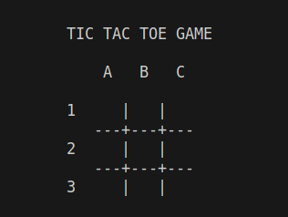

# <p style="color:pink; font-weight:bold;"> AI Tic-tac-toe player with Python </p>

My version of tic-tac-toe has two main modes: one with two human opponents who take turns filling an empty square with their piece, and the other with a human (you) against an artificial intelligence, **a bot**.


## <p style="color:pink">Project description:</p>
My project is my own implementation of a tic-tac-toe game in order to assimilate previously learned skills such as python and algorithm, symbolic AI and others.
I used Python to build this project because its purpose was to put into practice the skills I had learned so far. Also, it was built following the MVC design pattern to facilitate eventual integration of a better view as well as debugging/error handling.


## <p style="color:pink">How to install and run it?</p>
- Clone this repository

```bash
git clone https://github.com/johannessram/TicTacToe.git
```

- run the file main.py

```bash
python3 TicTacToe
```


## <p style="color:pink">How to use the project?</p>
1. You are prompted to choose between **`1`** and **`2`**
    - 1 to play against AI
    - 2 for a two-player mode game</br>
2. If you choose to play against AI, you are prompted to choose your avatar **`X`** or **`O`**</br>
3. Each player is allowed to place his pawn on any empty cell by providing its coordinates (Horizontal one before the Vertical one, for example **A3**, **B0**, ...)
X begins then O, and so on</br>
In the following image, all cells are empty.</br>

5. The one who manages to align three of their pawn first wins</br>


## <p style="color:pink">Licence:</p>
This project is licensed under the Attribution-NonCommercial license.
